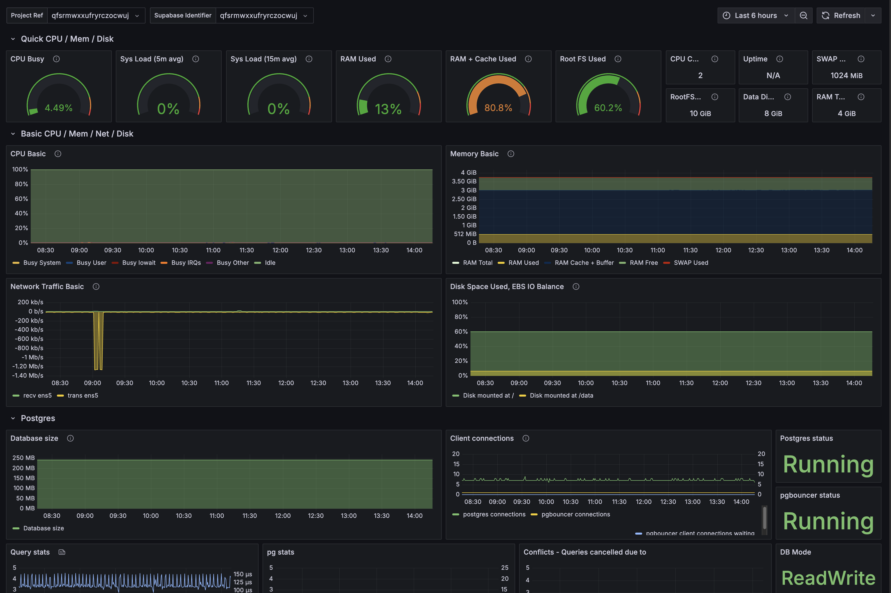

# `supabase-grafana`

Observability for your Supabase project, using Prometheus/Grafana, collecting [~200 metrics](./docs/metrics.md) at a granularity of 1 minute:


For more information, see our [documentation](https://supabase.com/docs/guides/telemetry/metrics)

⚠️ Note that this repository is an example and is not intended for production use. We strongly recommend that you setup metrics collection into your own observability stack, see the [Metrics](https://supabase.com/docs/guides/telemetry/metrics) page in our documentation for guidance.

If you just need the dashboard to import into your own Grafana instance (self-hosted or in the Cloud), you can find the source [here](./dashboard.json)

---

## Self-hosting

To run the collector locally using Docker Compose:

### Create secrets

Create an `.env` file:

```
cp .env.example .env
```

Fill it out with your project details.

1. To monitor a single project, fill out your `project ref` and `service role key`,  which you can find [here](https://app.supabase.com/project/_/settings/api).

2. Alternatively, to monitor multiple projects you'll need to create an access token [here](https://supabase.com/dashboard/account/tokens).

### Run with Docker

After that, simply start docker compose and you will be able to access Grafana:

```
docker compose up
```

### Access the dashboard



Visit [localhost:8000](http://localhost:8000) and login with the credentials:

- Username: `admin`
- Password: [the password in your `.env` file]

---

## Deploying to the Cloud

Deploy this service to a server which is always running to continuously collect metrics for your Supabase project.

You will need:
1. [Prometheus](https://prometheus.io/docs/introduction/overview/) (or compatible datasource)
2. [Grafana](https://grafana.com/docs/grafana/latest/)

### Deploy Prometheus

A managed Prometheus instance can be deployed on [Grafana Cloud](https://grafana.com/docs/grafana/latest/getting-started/get-started-grafana-prometheus/) or from Cloud Providers, like [AWS](https://aws.amazon.com/prometheus/) or [Digital Ocean](https://marketplace.digitalocean.com/apps/prometheus).

### Prometheus - Adding your Scrape Job

Configure your Prometheus instance with a scrape job that looks like this:

```yaml
scrape_configs:
  - job_name: "<YOUR JOB NAME>"
    metrics_path: "/customer/v1/privileged/metrics"
    scheme: https
    basic_auth:
      username: "service_role"
      password: "YOUR SERVICE KEY"
    static_configs:
      - targets: [
        "<YOUR SUPABASE PROJECT REF>.supabase.co:443"
          ]
        labels:
          group: "<YOUR LABEL CHOICE>"
```

### Prometheus - Adding a Scrape Job for your Read Replica(s)

Scraping your Read Replica for metrics is done as a separate Scrape Job within your Prometheus config. Under the `scrape_config` section, add a new job that looks like the example below.

As an example, if the identifier for your read replica is `foobarbaz-us-east-1-abcdef`, you would insert the following snippet:


```yaml
  - job_name: supabase-foobarbaz-us-east-1-abcdef
    scheme: https
    metrics_path: "/customer/v1/privileged/metrics"
    basic_auth:
      username: service_role
      password: __SUPABASE_SERVICE_ROLE_KEY__
    static_configs:
      - targets: ["foobarbaz-us-east-1-abcdef.supabase.co"]
        labels:
          group: "<YOUR LABEL CHOICE>"
```
### Deploy Grafana

A managed Grafana instance can be deployed on [Grafana Cloud](https://grafana.com/docs/grafana/latest/getting-started/get-started-grafana-prometheus/) or from Cloud Providers, like [AWS](https://aws.amazon.com/grafana/) or [Digital Ocean](https://marketplace.digitalocean.com/apps/grafana).

### Grafana - Add your Prometheus Data Source

Once running, log into your Grafana instance and select `Data Sources` on the left menu. Click `Add data source` and add your Prometheus information:
- Prometheus Server URL
- Credentials (where relevant)

Test it, save it and remember the name of your data source.

### Grafana - Add the Supabase Project Dashboard

Select `Dashboards` on the left menu, click `New` and then `Import`. Copy the file contents from this [dashboard](./dashboard.json) and paste it into the JSON field and click `Load`. Give the dashboard a name and select the Prometheus data source that you created previously. The dashboard will then load with the resource usage of your Supabase Project.


---

## Integrations

There are unofficial, third-party integrations (not affiliated with Supabase available) that are listed below:

1. [Datadog](https://docs.datadoghq.com/integrations/supabase/)
2. [Grafana Cloud](https://grafana.com/docs/grafana-cloud/monitor-infrastructure/integrations/integration-reference/integration-supabase/)
